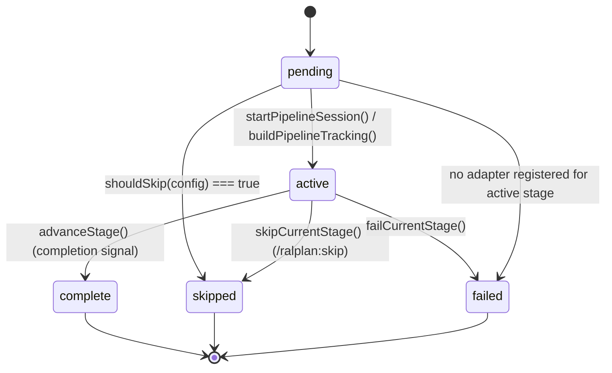
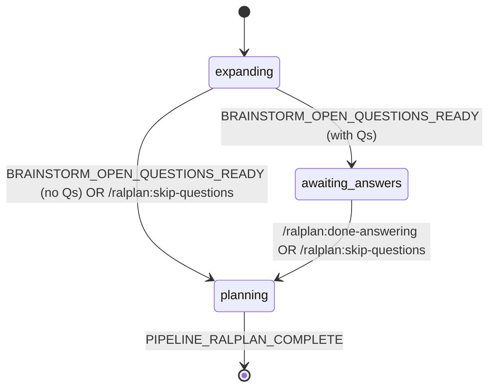

# pi-ralplan — Architecture & Flow Map

A complete walkthrough of how `pi-ralplan` works internally: entry points, state
machine, signal-based advancement, brainstorm sub-flow, persistence, worktree
lifecycle, and module dependencies.

## 1. System Overview

```
┌──────────────────────────────────────────────────────────────────────┐
│                         Pi (host runtime)                            │
│  ┌──────────────────────────────────────────────────────────────┐    │
│  │           ralplanExtension(pi: ExtensionAPI)                 │    │
│  │  ┌─────────────┐  ┌──────────────┐  ┌────────────────────┐  │    │
│  │  │  Commands   │  │     Tools    │  │   Event Handlers   │  │    │
│  │  │  (8 total)  │  │   (3 total)  │  │  session_start,    │  │    │
│  │  │             │  │              │  │  session_tree,     │  │    │
│  │  │             │  │              │  │  input,            │  │    │
│  │  │             │  │              │  │  before_agent_start│  │    │
│  │  │             │  │              │  │  agent_end,        │  │    │
│  │  │             │  │              │  │  turn_end          │  │    │
│  │  └──────┬──────┘  └───────┬──────┘  └─────────┬──────────┘  │    │
│  │         └─────────────────┴───────────────────┘             │    │
│  │                            │                                │    │
│  │                  ┌─────────▼──────────┐                     │    │
│  │                  │  Pipeline State    │                     │    │
│  │                  │  Machine           │                     │    │
│  │                  │  (pipeline.ts)     │                     │    │
│  │                  └─────────┬──────────┘                     │    │
│  │                            │                                │    │
│  │              ┌─────────────┼─────────────┐                  │    │
│  │              ▼             ▼             ▼                  │    │
│  │         ralplan →   execution →    ralph →      qa         │    │
│  │         (consensus)  (implement)   (verify)  (build/test)  │    │
│  └──────────────────────────────────────────────────────────────┘    │
└──────────────────────────────────────────────────────────────────────┘
         │                                       │
         ▼                                       ▼
   ┌──────────────┐                      ┌────────────────┐
   │  Git Worktree│                      │  plans/*.md    │
   │  (per idea)  │                      │  artifacts/    │
   └──────────────┘                      │  state.json    │
                                         └────────────────┘
```

## 2. Session Entry Points (4 ways to start)

```
┌────────────────────────────────────────────────────────────────────┐
│                        ENTRY POINTS                                │
└────────────────────────────────────────────────────────────────────┘
         │              │              │              │
         ▼              ▼              ▼              ▼
    ┌─────────┐    ┌─────────┐    ┌──────────┐   ┌──────────────┐
    │ --ralplan│    │ --brain-│    │ /ralplan │   │ /brainstorm  │
    │  flag    │    │  storm  │    │ command  │   │  command     │
    │ (CLI)    │    │  flag   │    │          │   │              │
    └────┬─────┘    └────┬────┘    └─────┬────┘   └──────┬───────┘
         │              │              │              │
         │              │              ▼              ▼
         │              │        ┌──────────────────────────┐
         │              │        │  pi.registerCommand()    │
         │              │        │  → handler(args, ctx)    │
         │              │        └────────────┬─────────────┘
         │              │                     │
         ▼              ▼                     │
    ┌────────────────────────────────────┐     │
    │  pi.registerFlag("ralplan" /       │     │
    │   "brainstorm", type:"boolean")    │     │
    └────────────────┬───────────────────┘     │
                     │                         │
                     ▼                         ▼
         ┌────────────────────────────────────────────┐
         │  pi.on("before_agent_start", ...)          │
         │  if (!isActive() && autoStartMode===null)  │
         │    if (pi.getFlag("ralplan"))              │
         │      autoStartMode = "ralplan"             │
         │    else if (pi.getFlag("brainstorm"))      │
         │      autoStartMode = "brainstorm"          │
         │    else                                     │
         │      autoStartMode = detectRalplanSkill...  │
         │              (event.prompt)                 │
         │                                             │
         │  Then in same handler:                      │
         │  if (autoStartMode && !hasRalplanState)    │
         │    startPipelineSession(idea, mode, ctx)   │
         └────────────────────┬───────────────────────┘
                              │
                              ▼
                 ┌──────────────────────────┐
                 │  startPipelineSession()  │
                 │  (shared helper)         │
                 └────────────┬─────────────┘
                              │
              ┌───────────────┼───────────────┐
              ▼               ▼               ▼
        resolvePipeline  buildPipeline    createWorktree
          Config()        Tracking()       ForRalplan()
              │               │               │
              └───────────────┴───────────────┘
                              │
                              ▼
                    buildDefaultState()
                              │
                              ▼
                       persistState()
                              │
                              ▼
              ┌───────────────┴───────────────┐
              ▼                               ▼
    pi.appendEntry("ralplan-state",    writeRalplanStateFile
                    persisted)         (cwd, state)
              │                               │
              ▼                               ▼
    Session entries (branch-safe)    .pi/ralplan/state.json
                                      (resume fallback)
```

**Key detail:** `autoStartMode` is captured and **nulled** before any async work to
prevent race conditions between two concurrent events.

## 3. Resume Flow (session_start / session_tree)

```
┌────────────────────────────────────────────────────────────────────┐
│  pi.on("session_start")    pi.on("session_tree")                  │
│  pi.on("session_tree")     (branch change)                         │
└────────────────┬───────────────────────────────────────────────────┘
                 │
                 ▼
        reconstructFromSession(ctx)
                 │
        ┌────────┴────────┐
        │                 │
        ▼                 ▼
   PRIMARY:          FALLBACK:
   scan session      if no entry:
   entries for       readRalplanStateFile
   type "custom"     (sessionCwd)
   customType        → .pi/ralplan/
   === "ralplan-     state.json
   state"
        │                 │
        └────────┬────────┘
                 │
                 ▼
         state = { ...restored... }
         autoStartMode = null  ← prevents re-trigger
                 │
                 ▼
            updateUI(ctx)
                 │
                 ▼
   If brainstorm.subPhase === "awaiting-answers":
      notify "🧠 Brainstorm resumed. Awaiting your answers."
```

## 4. The Stage State Machine

```
                    STAGE_ORDER (fixed)
    ┌──────────────────────────────────────────────┐
    │  ralplan → execution → ralph → qa            │
    └──────────────────────────────────────────────┘

    Each stage: status ∈ {pending, active, complete, failed, skipped}

    Build order: buildPipelineTracking(config)
      for each stage in STAGE_ORDER:
        adapter = getAdapterById(stageId)
        if adapter && !adapter.shouldSkip(config):
          status = "pending"
        else:
          status = "skipped"   ← terminal, can never be reactivated
      firstActiveIndex = first non-skipped index
      currentStageIndex = firstActiveIndex (or 0 if all skipped)


    ╔════════════════╗      advanceStage()       ╔════════════════╗
    ║  status=active ║ ─────────────────────►   ║  status=       ║
    ║  current=0     ║                          ║  complete      ║
    ╚════════════════╝                          ╚════════════════╝
                                                        │
                                                        ▼
                                              Find next non-skipped
                                              ┌────────┴────────┐
                                              │                 │
                                              ▼                 ▼
                                         found index       none left
                                              │                 │
                                              ▼                 ▼
                                       status="active"    currentStageIndex
                                       startedAt=now      = stages.length
                                              │            phase="complete"
                                              ▼
                                       Call onEnter(ctx)
                                       (worktree fallback here)
                                              │
                                              ▼
                                    ┌──────────────────┐
                                    │  getPrompt(ctx)  │
                                    │  → send to LLM   │
                                    └──────────────────┘

    skipCurrentStage(): same as advance but sets status="skipped"
    failCurrentStage(): sets status="failed" with error
    incrementStageIteration(): bumps current.iterations

    syncTrackingToConfig(): re-runs shouldSkip on pending/active stages
                            when config changes (e.g. via set_config tool)
```

## 5. Auto-Advancement via Signals (the heart of the loop)

```
┌────────────────────────────────────────────────────────────────────┐
│  pi.on("agent_end", async (event, ctx) => { ... })                 │
└────────────────┬───────────────────────────────────────────────────┘
                 │
                 ▼
         isActive() && state? ──no──► return
                 │
                yes
                 │
                 ▼
         currentStage = state.pipeline.stages[currentStageIndex]
                 │
                 ▼
         Deduplication guard:
         if (currentEntryId === lastAdvancedEntryId) return
         (prevents double-advance on same turn)
                 │
                 ▼
         lastText = getLastAssistantText(event.messages)
                 │
                 ▼
    ╔════════════════════════════════════════╗
    ║  BRAINSTORM MODE? (mode=="brainstorm") ║
    ╚════════┬═══════════════════════════════╝
             │
             ▼
    processBrainstormAgentEnd(state, lastText,
                              openQuestionsContent,
                              detectBrainstormSignal,
                              detectSignal)
             │
     ┌───────┼─────────┬────────────────┐
     ▼       ▼         ▼                ▼
  suppress  transition      transition   advance
  (do       -to-            -to-         (fall through
   nothing) awaiting        planning      to standard
             (questions     (no Q found   signal
              parsed         or user       detection
              from           skipped)      below)
              open-questions.md)
     │       │         │                │
     │       │         │                │
     ▼       ▼         ▼                ▼
    return  setTimeout  state.brainstorm   │
            (to escape   =                 │
             isStreaming transitionSubPhase│
             deadlock)  (state,            │
                  │     "planning")       │
                  ▼         │             │
            sendMessage      │             │
            (brainstorm-     │             │
             awaiting)       │             │
            triggerTurn:     │             │
            false            │             │
                  │         │             │
                  │         ▼             │
                  │      sendMessage      │
                  │      (brainstorm-     │
                  │       auto-plan)      │
                  │      triggerTurn:     │
                  │      true             │
                  │      deliverAs:       │
                  │      "steer"          │
                  │                       │
                  └───────────┬───────────┘
                              │
                              ▼
            ╔════════════════════════════════╗
            ║  STANDARD SIGNAL DETECTION     ║
            ║  detectSignal(lastText,        ║
            ║               currentStage.id) ║
            ╚═══════════════╤════════════════╝
                            │ (boolean)
                           yes
                            │
                            ▼
                  lastAdvancedEntryId =
                      currentEntryId
                            │
                            ▼
                  advanceStage(state.pipeline, ctx)
                            │
              ┌─────────────┼─────────────┐
              ▼             ▼             ▼
          "complete"     "failed"     next adapter
              │             │             │
              ▼             ▼             ▼
          notify()      notify()      getPrompt(ctx)
          setTimeout    setTimeout    transitionText
            (ralplan-    (ralplan-    = getTransitionPrompt
             complete)    failed)      + prompt
          deactivate   deactivate         │
                     │                     ▼
                     │              setTimeout (escape
                     │              isStreaming deadlock)
                     │                     │
                     │                     ▼
                     │              pi.sendUserMessage(
                     │                transitionText)
                     │
                     ▼
              updateUI(ctx)
```

**Critical fix in this code:** all `setTimeout(..., 0)` wrappers exist because
`pi.sendMessage`/`sendUserMessage` inside `agent_end` get pushed to a dead
`followUpQueue` when `isStreaming===true`. The defer escapes that phase.

## 6. Stage Prompt Injection (before_agent_start)

```
┌────────────────────────────────────────────────────────────────────┐
│  pi.on("before_agent_start", async (event, ctx) => { ... })        │
└────────────────┬───────────────────────────────────────────────────┘
                 │
                 ▼
   ┌─────────────────────────────────────────────┐
   │  Auto-start logic (only if !isActive &&      │
   │                    autoStartMode===null)     │
   │  - check --ralplan flag                      │
   │  - check --brainstorm flag                   │
   │  - check detectRalplanSkillUsage(prompt)     │
   │    (matches: "ralplan", "brainstorm",        │
   │     "consensus planning", "architect review"│
   │     "critic review", "plans/drafts/", etc.)  │
   └─────────────────────┬───────────────────────┘
                         │
                         ▼
   hasRalplanState? (any session entry of type
                     "ralplan-state" exists?)
         │                    │
        yes                  no
         │                    │
         ▼                    ▼
      (skip auto-start;    if autoStartMode set:
       already resuming)   startPipelineSession()
                                  │
                                  ▼
                          Continue to inject
                          stage prompt below
                                 │
                                 ▼
                  ┌──────────────┴──────────────┐
                  │                             │
                  ▼                             ▼
         isActive() && state?         (return undefined
                  │                    → no injection)
                 yes
                  │
                  ▼
         adapter = getCurrentStageAdapter(
                     state.pipeline)
                  │
                  ▼
         ┌────────────────┐
         │  Brainstorm    │
         │  awaiting-     │
         │  answers?      │──yes──► return {
         │                │          message: {
         └────────┬───────┘           customType:
                  │no                   "brainstorm-
                  │                     steering",
                  ▼                     content:
         return {                        getBrainstorm
           message: {                    SteeringPrompt(),
             customType:                 display: false
               "ralplan-prompt",       }
               content: "[RALPLAN
               ACTIVE — Stage: ...
               ]" + adapter.
                 getPrompt(ctx),
             display: false
           }
         }
```

## 7. Brainstorm Sub-Flow (the special case)

```
         startPipelineSession(idea, "brainstorm", ctx)
                              │
                              ▼
              state.brainstorm = createBrainstormState()
                                {
                                  subPhase: "expanding",
                                  questions: [],
                                  answers: []
                                }
                              │
                              ▼
                ┌──────────────────────────────┐
                │  PHASE 1: expanding          │
                │  Prompt: getBrainstorm       │
                │          ExpansionPrompt(ctx)│
                │  LLM writes ## Open Questions│
                │  section + saves to         │
                │  plans/open-questions.md    │
                │                              │
                │  AI emits:                   │
                │  BRAINSTORM_OPEN_QUESTIONS_  │
                │  READY                       │
                └──────────────┬───────────────┘
                               │
                               ▼
              processBrainstormAgentEnd detects signal
              reads plans/open-questions.md
              parseOpenQuestions() → string[]
                               │
                ┌──────────────┴───────────────┐
                │                              │
                ▼                              ▼
        questions.length > 0        questions.length === 0
                │                              │
                ▼                              ▼
   transitionSubPhase(brainstorm,    transitionSubPhase(brainstorm,
                  "awaiting-answers")            "planning")
   withQuestions(questions)            notify "No open questions
                │                       found. Proceeding
                │                       directly to planning."
                ▼                              │
   setTimeout(() =>                              │
     sendMessage({                              │
       customType: "brainstorm-                 │
         awaiting",                             │
       content: getBrainstorm                   │
         AwaitingPrompt(questions)              │
     }, { triggerTurn: false })                 │
   , 0)                                        │
                │                              │
                ▼                              ▼
        ┌─────────────────────────────────────────┐
        │  PHASE 2: awaiting-answers              │
        │  Prompt: getBrainstormSteeringPrompt()│
        │  AI must NOT plan/implement, just wait │
        │                                         │
        │  User input → pi.on("input") handler   │
        │  accumulates answers                    │
        └────────────────┬────────────────────────┘
                         │
         ┌───────────────┼───────────────┐
         │               │               │
         ▼               ▼               ▼
   User types       /ralplan:        /ralplan:skip-
   natural reply    done-            questions
         │          answering        (escape hatch)
         │               │               │
         ▼               ▼               ▼
   appendAnswer()   doneAnswering() skipQuestions()
   → write to       → transition-    → transition-
     answers.md       to-planning      to-planning
                       branch           branch
                       (in            (adds [SKIP]
                       answersPath)   entry)
         │               │               │
         └───────────────┴───────────────┘
                         │
                         ▼
              ┌──────────────────────────────┐
              │  PHASE 3: planning           │
              │  Now stage transitions from  │
              │  ralplan→execution→ralph→qa  │
              │  using normal signal logic   │
              │                              │
              │  getBrainstormResumePrompt() │
              │  includes all Q+A in markdown│
              └──────────────────────────────┘
```

**Answer accumulation detail** (`pi.on("input")`):

```
User types in awaiting-answers
    │
    ▼
isBrainstormMode(state) && isAwaitingAnswers(state.brainstorm)
    │
    ▼
processBrainstormInput(state, text) → { appendAnswer: {q,a} }
    │
    ▼
state.brainstorm = appendAnswer(state.brainstorm, q, a)
appendArtifact(workspace, "answers.md", "### Q: ... A: ...")
persistState()
return { action: "continue" }   ← AI never sees the answer
```

**Note:** During awaiting-answers, the prompt sanitizer (`sanitizeForPrompt`)
escapes known signal tokens to prevent the LLM from accidentally emitting
`PIPELINE_*_COMPLETE` while the user is still answering.

## 8. Pre-Execution Gate (input handler)

```
User types free-form message
                │
                ▼
       pi.on("input", async (event, ctx) => { ... })
                │
    ┌───────────┴────────────┐
    │  Brainstorm active +   │
    │  awaiting-answers?     │──yes──► accumulate answer (see §7)
    └───────────┬────────────┘
               no
                │
                ▼
       !isActive() && looksLikeBroadRequest(text) && !hasBypassPrefix(text)
                │
               yes
                │
                ▼
       ctx.ui.notify(
         "This looks like a broad request. Consider
          using /ralplan for consensus planning first,
          or prefix with 'force:' to bypass.",
         "info"
       )
                │
                ▼
       return { action: "continue" }   ← never blocks, just informs
```

**Heuristic (`gate.ts`):**

- **Broad indicator** = any of: `build me`, `create a`, `implement`, `develop`,
  `make a`, `write a`, `design a`, `set up`, `add feature`, `new feature`,
  `improve`, `optimize`, `refactor`, `fix this`, `update the`
- **Concrete anchor** = any of: file paths with extensions, `#NNN` issue numbers,
  camelCase, PascalCase, snake_case, numbered steps, code blocks, "acceptance
  criteria", "error:", "test runner/suite/file"
- **Gate fires** when: broad indicator AND no concrete anchor
- **Bypass**: prefix with `force:` or `! `

## 9. Worktree Lifecycle

```
startPipelineSession(idea, mode, ctx)
                │
                ▼
  createWorktreeForRalplan(sessionCwd, idea)
                │
                ├─► detectDefaultBranch(cwd)
                │     ├─► git symbolic-ref refs/remotes/origin/HEAD
                │     └─► git branch --show-current  (fallback)
                │
                ├─► resolveWorktreeRoot(cwd)
                │     → <parent>/<basename>-worktrees/
                │
                └─► createWorktree(config, sanitizedName)
                      │
                      ├─► sanitizeWorktreeName(name)
                      │     - strips traversal `..`, null bytes
                      │     - blocks absolute paths, drive letters
                      │     - non-alnum → "-", max 50 chars
                      │
                      ├─► generateUniqueWorktreePath() if collision
                      │     - appends -2, -3, ... then -<base36 ts>
                      │
                      ├─► validates baseBranch
                      │     regex: /^[a-zA-Z0-9._-]+(\/...)*$/
                      │
                      ├─► git worktree add -b feature/<name> <path> <base>
                      │     (uses execFileSync with arg array — safe)
                      │
                      └─► validateWorktree(path) confirms
                          .git file/dir exists
                          │
                          ▼
                    { success: true, path }
                │
                ▼
  state.worktreePath = path
  All future artifact writes go to <worktree>/plans/

  ════════════════════════════════════════════════
  TWO-ENTRY-POINT PATTERN (defensive):
  ════════════════════════════════════════════════

  Entry 1: command handlers (/ralplan, /brainstorm,
            --ralplan auto-start)
            → create worktree eagerly in startPipelineSession
            → set state.worktreePath

  Entry 2: executionAdapter.onEnter(ctx) — FALLBACK
            only fires for pipelines that SKIP planning
            (config.planning === false)
            │
            ▼
            if (context.worktreePath) return   ← skip if (1) ran
            createWorktreeForRalplan(...)     ← lazy
            context.worktreePath = result.path

  CLEANUP (only on cancel):
    deactivateState() → cleanupWorktree(state.worktreePath)
                       → git worktree remove <path>
                       (warns but doesn't block on failure)
```

## 10. Dual Persistence Model

```
                    persistState() called after every state mutation
                                       │
                 ┌─────────────────────┴─────────────────────┐
                 ▼                                           ▼
        pi.appendEntry(                          writeRalplanStateFile(
          "ralplan-state",                         sessionCwd, state
          { active, tracking,                      )
            originalIdea,                            │
            specPath, planPath,                     ▼
            sessionId, mode,                  .pi/ralplan/state.json
            answersPath, brainstorm,           (relative to sessionCwd
            worktreePath, sessionCwd }         = the ORIGINAL repo dir,
          )                                    not the worktree)
                 │                                  │
                 ▼                                  ▼
        ┌──────────────────────┐           ┌──────────────────────┐
        │  Session log         │           │  File on disk        │
        │  (in Pi's session)   │           │  (.pi/ralplan/       │
        │                      │           │   state.json)        │
        │  ✓ Branch-safe       │           │                      │
        │  ✓ Survives /tree    │           │  ✓ Survives full     │
        │  ✓ Time-ordered      │           │    Pi restart        │
        │  ✗ Lost on full      │           │  ✗ Lost on /tree     │
        │    Pi restart        │           │    (state is repo-   │
        │                      │           │     relative)        │
        └──────────────────────┘           └──────────────────────┘
                 │                                  │
                 └──────────────┬───────────────────┘
                                ▼
                    reconstructFromSession(ctx)
                                │
                ┌───────────────┴───────────────┐
                ▼                               ▼
        PRIMARY: scan entries             FALLBACK: if no entry,
        for type="custom"                  readRalplanStateFile()
        customType="ralplan-state"         (handles cold start)
        .pop() ← most recent
                │
                ▼
        reconstruct state with v1→v2→v3
        migration logic
```

**State version migration** (`state.ts`):

- v1: no `mode` field → add `mode: "ralplan"`
- v2: no `worktreePath`/`sessionCwd` → add `version: 3`, fields remain undefined
- v3: current
- v>3: refuse to load (forward-compat guard)

## 11. Iteration Counting & Max Enforcement

```
pi.on("turn_end", async (_event, ctx) => { ... })
                │
                ▼
  currentStage = state.pipeline.stages[currentStageIndex]
  maxIters = (config.verification is object
              ? config.verification.maxIterations
              : 100)
                │
                ▼
  if (currentStage.iterations >= maxIters)
    │
    ▼
  ctx.ui.notify(
    "Maximum iterations (N) reached for <stage>.
     Please review and manually approve or use
     /ralplan:skip to proceed.",
    "warning"
  )
  return  ← STOP; don't increment
                │
              (under limit)
                │
                ▼
  state.pipeline = incrementStageIteration(state.pipeline)
  persistState()
  updateUI(ctx)
```

## 12. Commands & Tools Map

```
┌────────────────────────────────────────────────────────────────────┐
│  COMMANDS (user-facing slash commands)                             │
├──────────────┬─────────────────────────────────────────────────────┤
│ /ralplan     │ startPipelineSession("ralplan") + sendStartMessage  │
│ /brainstorm  │ startPipelineSession("brainstorm") + sendStartMessage│
│ /ralplan:    │ show status, mode, sub-phase, HUD lines             │
│   status     │                                                     │
│ /ralplan:    │ ctx.ui.confirm → deactivateState()                  │
│   cancel     │   (cleans up worktree, persists, clears file)       │
│ /ralplan:    │ skipCurrentStage() + send next-stage prompt         │
│   skip       │   via getTransitionPrompt()                         │
│ /ralplan:    │ doneAnswering() → transition to planning            │
│   done-      │   + send getBrainstormResumePrompt()                │
│   answering  │                                                     │
│ /ralplan:    │ skipQuestions() + write sentinel to answers.md      │
│   skip-      │   + send getBrainstormResumePrompt()                │
│   questions  │                                                     │
│ /ralplan:    │ readPlanningArtifacts(workspace) →                 │
│   artifacts  │   list specs/plans/test-specs in plans/            │
└──────────────┴─────────────────────────────────────────────────────┘

┌────────────────────────────────────────────────────────────────────┐
│  TOOLS (callable by LLM via function calling)                      │
├──────────────┬─────────────────────────────────────────────────────┤
│ ralplan_     │ advanceStage() + send next prompt as                │
│   advance    │ deliverAs:"followUp" triggerTurn:true                │
│              │ (use case: LLM wants to skip a stage explicitly)   │
├──────────────┼─────────────────────────────────────────────────────┤
│ ralplan_     │ writeArtifact(workspace, filename, content)         │
│   submit_    │ → plans/<filename>.md                               │
│   artifact   │ (no session required — can be called any time)      │
├──────────────┼─────────────────────────────────────────────────────┤
│ ralplan_     │ patches state.pipeline.pipelineConfig in place:     │
│   set_config │   planning: ralplan|direct|skip                     │
│              │   execution: team|solo                              │
│              │   verification: ralph|<maxIter>|skip                │
│              │   qa: true|false                                    │
│              │ then syncTrackingToConfig() re-runs shouldSkip      │
│              │ (no session = no-op)                                │
└──────────────┴─────────────────────────────────────────────────────┘
```

## 13. UI Surface

```
updateUI(ctx) — called after every state mutation
                │
        ┌───────┴────────┐
        │                │
   not active         active
        │                │
        ▼                ▼
  setStatus(         ┌──────────────────────────┐
   "ralplan",        │  Brainstorm mode?        │
   undefined)        │  ├─ expanding:           │
  setWidget(         │  │  "🧠 Expanding..."    │
   "ralplan-         │  ├─ awaiting-answers:    │
    progress",       │  │  "🧠 Awaiting Answers │
   undefined)        │  │   (N questions)"      │
        │            │  └─ planning:            │
        │            │     "🧠 Planning         │
        │            │      (Consensus)"        │
        │            └──────────┬───────────────┘
        │                       │ (or RALPLAN mode)
        │                       ▼
        │              getPipelineStatus(pipeline)
        │                       │
        │              ┌────────┴────────┐
        │              ▼                 ▼
        │         current adapter    "Complete"
        │         name               or stage id
        │              │                 │
        │              └────────┬────────┘
        │                       ▼
        │              "📋 <name> (X/Y stages)"
        │                       │
        │                       ▼
        │              setStatus("ralplan", ...)
        │              setWidget("ralplan-progress",
        │                        formatPipelineHUD)
        │                       │
        │                       ▼
        │              lines = [
        │                "[OK] Planning (RALPLAN)",
        │                "[>>] Execution (iter 3)",
        │                "[..] Verification (RALPH)",
        │                "[--] Quality Assurance"
        │              ]
        ▼
      done
```

## 14. End-to-End Example: `/ralplan add user auth`

```
1. User types:  /ralplan add user auth
                     │
2.   /ralplan command fires
     isActive()? No
     idea = "add user auth"
     startPipelineSession(...)
        ├─ resolvePipelineConfig() → { planning: "ralplan", ... }
        ├─ buildPipelineTracking() → 4 stages, current=0
        ├─ createWorktreeForRalplan(cwd, "add user auth")
        │    → git worktree add -b feature/add-user-auth .../add-user-auth
        ├─ buildDefaultState(idea, tracking, ..., "ralplan", sessionCwd)
        └─ persistState()  (entry + file)
     updateUI(ctx)
     sendStartMessage()
        → sendMessage({ customType:"ralplan-start",
                        content: "## RALPLAN Pipeline Started ...",
                        deliverAs:"steer", triggerTurn:true })
                     │
3.   First agent turn begins
     pi.on("before_agent_start")
        ├─ isActive? Yes (already started)
        ├─ adapter = ralplanAdapter
        ├─ context = buildContext()
        ├─ not awaiting-answers
        └─ return { message: { customType:"ralplan-prompt",
                               content: "[RALPLAN ACTIVE — Stage: Planning (RALPLAN)]
                                         ### Worktree Creation ...
                                         ### Date-Based Naming ...
                                         ### ADR ...
                                         ## RALPLAN (Consensus Planning)
                                         ... full consensus prompt ...",
                               display: false } }
                     │
4.   LLM does Planner → Architect → Critic (separate sub-agents)
     Writes plans/drafts/plan_draft.md
     Saves plans/spec.md, plans/plan.md
                     │
5.   LLM emits:  PIPELINE_RALPLAN_COMPLETE
                     │
6.   pi.on("agent_end")
     detectSignal(lastText, "ralplan") → true
     lastAdvancedEntryId = currentEntryId
     advanceStage(state.pipeline, ctx)
        ├─ current="complete"
        ├─ next index = 1 (execution)
        ├─ stages[1].status = "active"
        ├─ executionAdapter.onEnter(ctx)  (worktree fallback — no-op, already set)
        └─ phase = "execution"
     persistState(), updateUI
     getPrompt(executionAdapter, ctx) → solo/team execution prompt
     setTimeout(() => pi.sendUserMessage(transitionText), 0)
                     │
7.   Loop continues: execution → PIPELINE_EXECUTION_COMPLETE
                     → ralph → PIPELINE_RALPH_COMPLETE
                     → qa → PIPELINE_QA_COMPLETE
                     │
8.   On QA completion:
     advanceStage returns phase="complete"
     setTimeout(() => sendMessage({ customType:"ralplan-complete",
                                    content: "## RALPLAN Pipeline Complete! ✓",
                                    triggerTurn:false }), 0)
     deactivateState() → cleanup worktree → clear file
```

## 15. Key Invariants / Guarantees

| Invariant                                                   | Enforced by                              | Where                             |
| ----------------------------------------------------------- | ---------------------------------------- | --------------------------------- |
| Exactly one of N stages is `active` at a time               | `advanceStage`/`skipCurrentStage`        | `pipeline.ts:232, 286`            |
| A `skipped` stage can never be re-activated                 | status check in `syncTrackingToConfig`   | `pipeline.ts:178-183`             |
| State mutations always dual-write                           | `persistState()` is the only write path  | `index.ts:183-200`                |
| Signal detection ignores code blocks & comments             | `splitByCodeBlocks` + `isSignalLine`     | `signals.ts:56-88`                |
| Stage auto-advance fires once per turn                      | `lastAdvancedEntryId` dedup              | `index.ts:982-985`                |
| Resume never re-triggers auto-start                         | `autoStartMode = null` in reconstruction | `index.ts:295`                    |
| Worktree dir is always a sibling of the repo, never inside  | `resolveWorktreeRoot` strips + re-prefix | `utils.ts:32-37`                  |
| All shell args are arrays, never interpolated               | `execFileSync(..., [args])` throughout   | `worktree.ts`                     |
| Worktree name rejects traversal, null bytes, absolute paths | `sanitizeWorktreeName`                   | `worktree.ts:59-71`               |
| User-typed signals are sanitized when injected into prompts | `sanitizeForPrompt` (escapes tokens)     | `brainstorm.ts:94-105`            |
| `isStreaming` deadlock escaped via `setTimeout(0)`          | all `agent_end` sendMessage calls        | `index.ts:1028, 1085, 1104, 1128` |

## 16. Module Dependency Graph

```
                        ┌──────────────┐
                        │  index.ts    │  (extension entry)
                        │  ~1200 lines │
                        └──┬───┬───┬───┘
                           │   │   │
            ┌──────────────┘   │   └──────────────┐
            ▼                  ▼                  ▼
       ┌─────────┐       ┌──────────┐       ┌──────────┐
       │pipeline │       │  state   │       │ worktree │
       │  .ts    │◄──────┤  .ts     │       │  .ts     │
       │ pure    │       │ persist  │       │ git ops  │
       └────┬────┘       └────┬─────┘       └────┬─────┘
            │                 │                  │
            │           ┌─────▼─────┐            │
            │           │  utils.ts │◄───────────┘
            │           │  paths    │
            │           └─────┬─────┘
            │                 │
            │           ┌─────▼─────┐
            │           │ brainstorm│
            │           │   .ts     │
            │           └───────────┘
            │
   ┌────────┴────────┬──────────────┬─────────────┐
   ▼                 ▼              ▼             ▼
┌──────┐        ┌─────────┐   ┌──────────┐  ┌──────────┐
│adapt-│        │signals  │   │artifacts │  │ gate.ts  │
│ers.ts│        │  .ts    │   │   .ts    │  │heuristic │
│prompt│        │detection│   │  I/O     │  └──────────┘
│gen.  │        └─────────┘   └────┬─────┘
└──┬───┘                           │
   │                               │
   ├────────► prompts.ts            │
   │         (templates)            │
   │                                │
   └────────► naming.ts ◄───────────┘
             (date slugs)
```

The core pipeline (`pipeline.ts`, `brainstorm.ts`, `signals.ts`, `naming.ts`,
`artifacts.ts`, `gate.ts`, `utils.ts`, `prompts.ts`, `adapters.ts`) is **pure or
near-pure** — most files have no side effects beyond file I/O. This is what
makes the 282-test suite possible: 90%+ of logic is unit-testable without
mocking the extension runtime.

`index.ts` is the only file that touches the `ExtensionAPI` and is the
integration point.

## 17. Mermaid State Diagrams

Visual companion to the ASCII diagrams in §4 and §7. Renders natively on GitHub and GitLab. Authoritative source for the FSM shape is [ADR 0007](../docs/adr/0007-hand-rolled-state-machine.md) — these diagrams must be kept in sync with `pipeline.ts` and `brainstorm.ts` if either changes.

### 17.1 Pipeline stage machine (`pipeline.ts`)

Each stage moves through the five `StageStatus` values: `pending → active → (complete | skipped | failed)`. The `[*]` markers denote the FSM entry point and the three terminal pseudo-states returned as `PipelinePhase` (`complete | failed | cancelled`).



**Per-stage notes:**

- `shouldSkip` is evaluated at three distinct times: construction (`buildPipelineTracking`), mid-flight config change (`syncTrackingToConfig`), and the advance loop inside `advanceStage` / `skipCurrentStage`.

- `skipped` is terminal **at the stage level** — a skipped stage is never re-activated, even if config later un-skips it (the spec/plan explicitly preserves this invariant; see `pipeline.ts:178-183`).

- `failed` stays in place; the FSM does not auto-advance past a failed stage. The user must `/ralplan:skip` or restart.

### 17.2 Brainstorm sub-machine (`brainstorm.ts`)

Runs _inside_ the `ralplan` stage when `state.mode === "brainstorm"`. Three states, no parallel regions.



**Sub-phase notes:**

- `awaiting_answers` is the only state where user `input` events are accumulated into `BrainstormState.answers` via `appendAnswer()`. In `expanding` and `planning`, user input is routed to the gate heuristic or the pipeline signal detector respectively.

- `BRAINSTORM_OPEN_QUESTIONS_READY` is a LLM-emitted signal. The transition function `processBrainstormAgentEnd` is a pure decision function that classifies it into one of four actions: `suppress`, `transition-to-awaiting`, `transition-to-planning`, or `advance`.

- Mermaid requires underscores in state names; the codebase uses hyphens (`awaiting-answers`). This diagram uses `awaiting_answers` for rendering and the [ADR 0007](../docs/adr/0007-hand-rolled-state-machine.md) documents the mapping.

### 17.3 Why hand-rolled (TL;DR)

See [ADR 0007](../docs/adr/0007-hand-rolled-state-machine.md) for the full rationale. Short version:

- 7 effective states, 1 user-initiated branch, 1 config-driven skip — below the threshold where a library pays for itself.

- All transition functions are already pure and immutable.

- 273 tests directly target the public FSM API; migration would rewrite ~75 of them.

- Zero state-machine dependencies is a deliberate posture for a Pi extension.

- Re-evaluate only if any of T-1..T-5 in ADR 0007 fires.
